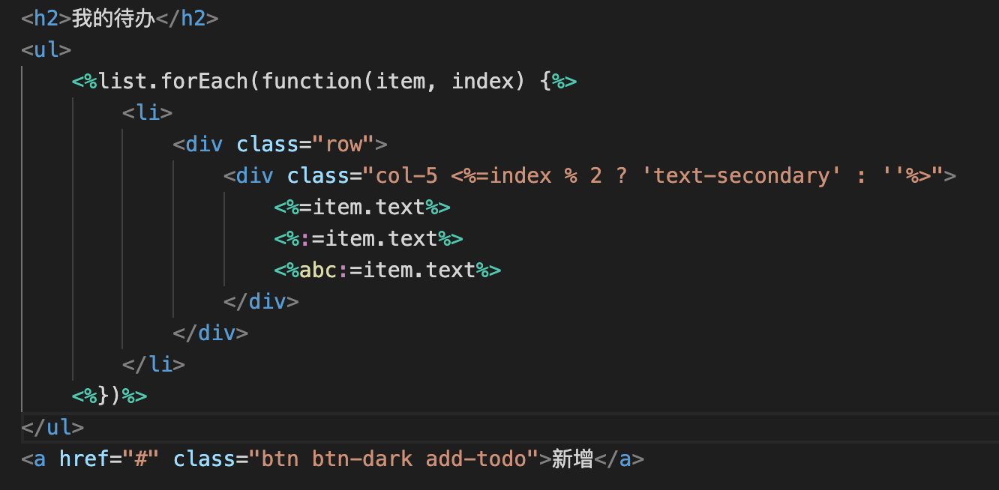

# [template-atom](https://github.com/yanhaijing/template-atom)

[template.js](https://github.com/yanhaijing/template.js) plugin for atom，[click here](https://atom.io/packages/language-templatejs) to install

## Features

- Syntax highlight

Support syntax highlight for template.js

Source code example

```
<h2>我的待办</h2>
<ul>
    <%list.forEach(function(item, index) {%>
        <li>
            <div class="row">
                <div class="col-5 <%=index % 2 ? 'text-secondary' : ''%>">
                    <%=item.text%>
                    <%:=item.text%>
                    <%abc:=item.text%>
                </div>
            </div>
        </li>
    <%})%>
</ul>
<a href="#" class="btn btn-dark add-todo">新增</a>
```

Highlighting effect



## CHANGELOG
[CHANGELOG.md](https://github.com/yanhaijing/template-atom/blob/master/CHANGELOG.md)

## TODO
[TODO.md](https://github.com/yanhaijing/template-atom/blob/master/TODO.md)

## Contributor guide
安装完atom，会自动安装一个全局命令apm(mac是这样的)

```bash
apm publish # 发布包
apm publish [major|minor|patch] # 发布指定版本的包
```

## Reference

- [如何从0开发一个Atom组件](https://segmentfault.com/a/1190000014322520)
